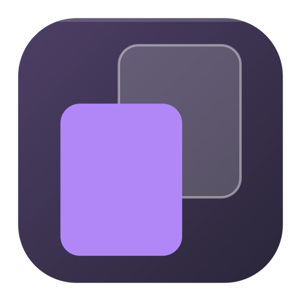
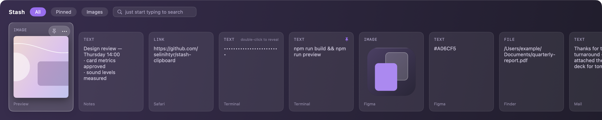

<div align="center">



# Stash

**The card-based clipboard manager for macOS, without the subscription.**

Press ⌥⌘V and your history slides up as a strip of cards — images you can
actually see, not filenames in a list. Pick one, press ↵, it lands where you
were typing. Nothing leaves your Mac, and it hides API keys and card numbers
before anyone reads them over your shoulder.

</div>



## Why it exists

macOS has no clipboard history. The free managers are lists that show images as
filenames; the ones with a card interface — Paste, Pastebot — want $25 a year
or $13 up front. Stash is the card interface, free, local-only, and it does a
few things none of them do.

## What's different

**It hides your secrets on screen.** API keys, tokens and card numbers show as
dots until you double-click. No other clipboard manager does this, and if you
copy credentials all day, your history is the one window you don't want open in
a meeting. Card numbers are Luhn-checked, so an ISBN isn't mistaken for one.

**A bare link stays readable, a link with a token doesn't.** Masking every URL
would make the strip useless — masking a password-reset link is the entire
point. Stash tells them apart.

**Pasting an image adapts to where it lands.** Notes gets the image. Terminal,
which can't take images at all, gets the file path instead of nothing. Finder
gets the file.

**It catches ⌘⇧4 screenshots.** Those write straight to disk and never touch
the clipboard, so no clipboard manager can see them. Stash can watch the folder
— opt-in, off by default, and only files macOS itself tags as screenshots.

**Nothing about you leaves your Mac.** Your clipboard is never uploaded
anywhere: no account, no sync, no telemetry, no third-party dependencies to
audit. Stash makes exactly one kind of network request — once a day it asks
GitHub whether a newer version exists, so you don't have to find out by
accident. It sends nothing but a version-agnostic anonymous GET; you can read
every line of it in `Sources/Updater/`, and you can switch it off in Settings,
after which Stash never touches the network at all.

**It doesn't lie to you.** If it can't paste, it says so instead of closing
silently. If it only copied, the sound you hear is the copy sound. If your
database is corrupt it's moved aside, never deleted.

<details>
<summary>Smaller decisions, if you like this sort of thing</summary>

- The app never re-captures its own paste — otherwise every paste would
  overwrite a card's "copied from" and filtered pastes would duplicate entries.
- Deleting a shelf keeps its cards. You're removing a folder, not binning what
  was in it.
- "Clear everything" spares what you pinned, and deletes the image files too,
  not just the database rows.
- Card controls act on the card under your pointer, not the selected one — so
  reaching for the mouse never changes what ↵ would paste.
- Database integrity is checked at open with `PRAGMA quick_check`, so a
  half-written page surfaces then instead of failing mysteriously weeks later.
- Startup is silent: whatever is already on the clipboard when Stash launches
  gets stored without a sound, because you didn't just do anything.

</details>

## Install

No Homebrew formula. Until a build is published on the
[releases page](https://github.com/selinihtyr/stash-clipboard/releases), build
it from source — after that, Stash keeps itself up to date (see Updating).

```bash
git clone https://github.com/selinihtyr/stash-clipboard.git
cd stash-clipboard
./scripts/bundle.sh
cp -R build/Stash.app /Applications/
open /Applications/Stash.app
```

macOS may block an unsigned app on first launch: right-click Stash in
`/Applications` and choose **Open**.

### Updating

Stash updates itself. It checks GitHub for a new release once a day; when there
is one, the menu item turns into **Update to 0.x.y…**, and picking it downloads
the build, verifies its signature, replaces the copy you're running and reopens
it. Nothing to delete, nothing to download by hand.

Two things worth knowing:

- **The copy must be somewhere you can write to.** Stash checks this *before*
  quitting, so a copy sitting in a read-only place says so instead of leaving
  you with no app at all.
- **If you built Stash yourself, the first update changes its signature** —
  yours becomes the release identity — and macOS treats a differently-signed
  app as a different one, so Accessibility has to be granted again (see
  Signing, below). The update dialog says so before you agree to it.

Prefer to stay on your own build? Turn off "Check for updates automatically" in
Settings, and update the way you installed: `git pull && ./scripts/bundle.sh`.

### Signing — read this, or pasting will look broken

The Accessibility permission is bound to the app's signature, so how it is
signed directly affects daily use. `scripts/bundle.sh` picks, in order:

1. `STASH_SIGN_IDENTITY` if you set it,
2. otherwise the first developer certificate on the machine (Apple Development
   or Developer ID),
3. otherwise an ad-hoc signature.

**Signed with a certificate**, the identity is stable and the permission
survives rebuilds — grant it once and you're done.

**Signed ad-hoc**, there is no stable identity to bind to, so macOS ties the
permission to the signature's hash, which changes every time the binary does.
**Every rebuild silently invalidates the permission**: Stash keeps working, but
paste quietly degrades to copy. Remove and re-add Stash under System Settings →
Privacy & Security → Accessibility, or run
`tccutil reset Accessibility social.selin.stash` and grant it again.

## Permissions

**Accessibility** is required for direct pasting (System Settings → Privacy &
Security → Accessibility). Without it Stash still works — it copies your
selection and leaves ⌘V to you.

The global shortcut needs no permission at all (it uses Carbon's
`RegisterEventHotKey`, not an accessibility observer).

**Files and Folders** is required only if you enable screenshot-folder
watching. Refuse it and the switch turns itself back off and tells you why — it
never sits there looking "on" while doing nothing.

## Shortcuts

| Key | Action |
|---|---|
| ⌥⌘V | Open/close the strip |
| ← → | Move between cards |
| typing | Search history |
| ⌫ | Edit the search text |
| ↵ | Paste |
| ⌥↵ | Paste with filters applied |
| ⌘1…⌘9 | Paste the card at that position |
| ⌃P | Pin / unpin |
| ⌃S | Move to shelf |
| ⌘⌫ | Delete the card |
| ⇥ | Switch tab |
| Esc | Close |

⌫ edits the search box rather than deleting a card — deleting moved to ⌘⌫ so
you can't lose a card while typing a search.

## Privacy

- **By default it watches only the clipboard.** Screenshot-folder watching is
  the single feature that reaches beyond it, and it is opt-in and off by
  default.
- **One network request, and it isn't about you.** Once a day Stash asks
  `api.github.com` for the latest release of this repository. The request is
  anonymous — no account, no identifier, no clipboard content, no telemetry,
  and the URL session is `ephemeral` so nothing is cached or stored. You can
  verify the scope of it: `grep -rln "URLSession\|import Network\|CFSocket"
  Sources` matches one file, `Sources/Updater/ReleaseClient.swift`. Turn
  "Check for updates automatically" off in Settings and Stash makes no
  requests at all — checking then only happens if you pick "Check for
  Updates…" from the menu yourself.
- **An update is verified before it runs.** A downloaded build is rejected
  unless it is signed by the identity that signs Stash (team `HN964HX2UA`,
  pinned in `Sources/Updater/SignatureCheck.swift`), carries the expected
  bundle identifier, and is the version it claimed to be. Rejected downloads
  are deleted, not quarantined and forgotten.
- **Password-manager content is never stored** — see above.
- **Card numbers and tokens are masked** on the card face, revealed with a
  double-click.
- **The database is not encrypted.** `~/Library/Application Support/Stash/` is
  readable only by your user (mode `0700`), but encryption at rest is
  FileVault's job. With FileVault off, your history sits there in plain text.

### Known limits of masking

- Text containing a space is never masked, so a `Bearer eyJ…` header, a
  `curl -H "Authorization: …"` line, or a sentence like "my password is …"
  shows in full.
- This is a shoulder-surfing deterrent, not a data-loss-prevention boundary.
  It's heuristic: occasionally it hides something ordinary (double-click to
  reveal) and occasionally it misses something unusual.

## Launch at login

The "Launch at login" switch uses `SMAppService.mainApp`, which requires Stash
to be installed as a proper bundle in `/Applications` — registration fails for
a copy run straight out of the build directory. If registration fails the
switch reflects reality rather than what you clicked, and says why.

## Development

```bash
swift test                  # all modules
./scripts/bundle.sh debug
```

Architecture and the reasoning behind each decision:
`docs/superpowers/specs/2026-08-04-stash-clipboard-design.md`

Manual QA checklist to run before a release: `docs/manual-qa.md`

## Sound credits

The copy and paste sounds (`Sources/Stash/Resources/Sounds/`) are not macOS
system sounds. They are two separate Freesound recordings under two different
licences, and **neither is covered by this project's MIT licence**.

**`copy.wav` — attribution required**

- Source: "soft sound plastic button click" by orginaljun —
  https://freesound.org/s/150382/
- Licence: Creative Commons Attribution 3.0 Unported (CC-BY 3.0) —
  https://creativecommons.org/licenses/by/3.0/
- Changes: downmixed to mono, trimmed, tail faded, level lowered. CC-BY 3.0
  permits derivatives and requires changes to be marked; this line marks them.

**`paste.wav` — no attribution required**

- Source: "inventory_select" by obrymec — https://freesound.org/s/580829/
- Licence: Creative Commons 0 (CC0) —
  https://creativecommons.org/publicdomain/zero/1.0/
- Changes: downmixed to mono, trimmed, tail faded, level adjusted. The credit
  above is a courtesy.

The same terms sit next to the files in
`Sources/Stash/Resources/Sounds/CREDITS.txt`, so they travel with the folder if
it is copied out of the repo.

## Licence

Code: MIT. The two sound files are excluded — `copy.wav` is CC-BY 3.0 and
`paste.wav` is CC0 (see Sound credits).
